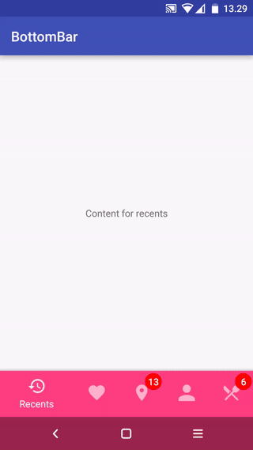
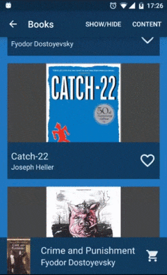

# Android---CustomView
收集的一些自定义View

**1.Easy count down by TextureView：仿手淘倒计时**     
项目地址:https://github.com/CaMnter/EasyCountDownTextureView      
   

**2.A custom view component that mimics the new Material Design Bottom Navigation pattern**    
https://github.com/roughike/BottomBar      

**2.1.An bottom navigation bar for Android**      
https://github.com/tyzlmjj/PagerBottomTabStrip

**3.ViewPager that slides vertically.垂直滑动的ViewPage**         
https://github.com/Telenav/ExpandablePager     

**4.TriangleLabelView : 显示三角图形的tag**     
https://github.com/shts/TriangleLabelView       

**5.Navigation tab bar with colorful interactions.**    
https://github.com/DevLight-Mobile-Agency/NavigationTabBar      

**6.3d旋转切换view , 类似旋转木马效果。**     
https://github.com/dalong982242260/LoopRotarySwitch     

**7.android 悬浮窗菜单，可在launcher或app中使用**            
https://github.com/crosg/FloatMenuSample                

 
**8.DialogFragment swipeable away like Tinder UI.**            
https://github.com/kakajika/SwipeAwayDialog            

**9.可定制的ViewPagerIndicator,当然不通过ViewPager也可以用.**           
https://github.com/jiang111/ScalableTabIndicator           

**10.一个垂直方向的DrawerLayout,抽屉从上向下展开**            
https://github.com/corerzhang/VerticalDrawerLayout           

**11.PaperOnboarding is a material design slider**       
https://github.com/Ramotion/paper-onboarding-android             

**12.Android流式布局，支持点击、单选、多选等，适合用于产品标签等，用法采用Adapter模式，和ListView、GridView用法一样！**      
https://github.com/hanhailong/FlowTag            

**13.This Library helps users to use Bottom Navigation Bar (A new pattern from google) with ease and allows ton of customizations**           
https://github.com/Ashok-Varma/BottomNavigation               

**14.FaceOffToggleButton:Toggle button which shows a happy face for checked or unhappy for unchecked.**                
https://github.com/Nightonke/FaceOffToggleButton               

**15.一个别致的环形菜单**      
https://github.com/Hitomis/CircleMenu        

**16.A Helper for SystemBar include StatusBar and NavigationBar**               
https://github.com/H07000223/FlycoSystemBar              

**17.用于展示注册进度的view**             
https://github.com/jiang111/ProgressView              

**17.1.带有动态效果的表单引导进度**     
https://github.com/VictorAlbertos/BreadcrumbsView    

**18.基于第三方WheelView 实现的一个时间选择器**                  
https://github.com/chsmy/DateSelecter          

**19.自定义EditText实现右下角计数控件**            
https://github.com/FTandJYQ/AnFQNumEditText

**20.利用三阶贝塞尔曲线模仿QQ空间直播页面右下角的礼物冒泡特效**                
https://github.com/Yasic/QQBubbleView
 

**21.CircleIndicator for ViewPager**              
https://github.com/Modificator/CircleIndicator            

**22.一种可根据展开是否超出屏幕来判断父控件是否自动滚动的ExpandableLayout**         
https://github.com/SilenceDut/ExpandableLayout        

**23.一款漂亮的 Bottom Sheet 选择器**     
https://github.com/philliphsu/BottomSheetPickers

**24.酷炫信用卡View**     
https://github.com/cooltechworks/CreditCardView     

**25.自定义卡片集view，支持展开收缩滚动**     
https://github.com/loopeer/CardStackView       

**26. A Series Of Badge Drawables For Android.**     
https://github.com/nekocode/Badge       

**27.Step by step，just use HorizontalStepView，VerticalStepView. step indicator，flow indicator，timeline，order process**          
https://github.com/baoyachi/StepView      

**28.An Android text view with scrolling text change animation**   
https://github.com/robinhood/ticker     

**29.电影票在线选座**    
https://github.com/qifengdeqingchen/SeatTable    

**30.自动格式化银行卡号的EditText，每四位增加一个空格，并根据银行卡号判断该银行卡归属的银行及卡别**          
https://github.com/smuyyh/BankCardFormat          

**31.Add a headview for any view and supports sticking the navigator on the top when ItemView scrolls.**    
https://github.com/w446108264/ScrollableLayout    

**32.一个简单，强大的广告活动弹窗控件**    
https://github.com/yipianfengye/android-adDialog         

**33.ViewPager cards inspired by Duolingo**            
https://github.com/rubensousa/ViewPagerCards

**34.An android process bar library associated with ViewPager through single method**     
https://github.com/hzw1199/android_ProcessBar     

**35.A cool material sign up transition.**                   
https://github.com/JeasonWong/SignUpTransition         

**36.SpiderWebScoreView是用于Android上的一个蛛网评分控件**         
https://github.com/xiaopansky/SpiderWebScoreView                
https://github.com/RikkaW/MaterialPreference

**37.Android 支持水平和垂直滑动的ViewPager**                   
https://github.com/DevLight-Mobile-Agency/InfiniteCycleViewPager            

**38.可以记住历史选项的spinner**             
https://github.com/Jasonchenlijian/MemorySpinner            

**39.使用方便的的 Material Design 风格 Preference UI，包含一个根据规范自制的新的 SimpleMenuPreference**           
https://github.com/RikkaW/MaterialPreference

**40.仿支付宝芝麻信用分仪表盘效果**            
https://github.com/HotBitmapGG/CreditSesameRingView    

**50.RecyclerView实现Card Gallery效果，替代ViewPager方案**      
https://github.com/huazhiyuan2008/RecyclerViewCardGallery          

**51.纯用SVG做的Google I/O 2016那个炫酷的时钟**          
https://github.com/lypeer/GoogleClock           

**52.Android 角标组件效果**          
https://github.com/czy1121/cornerlabelview         

**53.一个展示下载进度的View，下载完成和失败的时候会有酷酷的动画.**               
https://github.com/dudu90/FreshDownloadView       

**54.自定义 自动补充 email 的 EditTextAuto Fill the custom email to EditText**         
https://github.com/wangshaolei/AutoFillEmailEditText           

**55.类似手机QQ界面右上角的弹出菜单，使用recyclerview和popupwindow封装了一下.**
https://github.com/zaaach/TopRightMenu       

**56.一款漂亮的周日历组件A simple weekly calendar.**         
https://github.com/nomanr/weekcalendar     

**57.比原生 Snack 更漂亮的 Bottom Notification 库Snacky is a small library to help you adding a Snackbar to your android project.**        https://github.com/matecode/Snacky         

**58.可设置圆角背景边框的的按钮**       
https://github.com/czy1121/roundbutton          

**59.**          

**60.**

